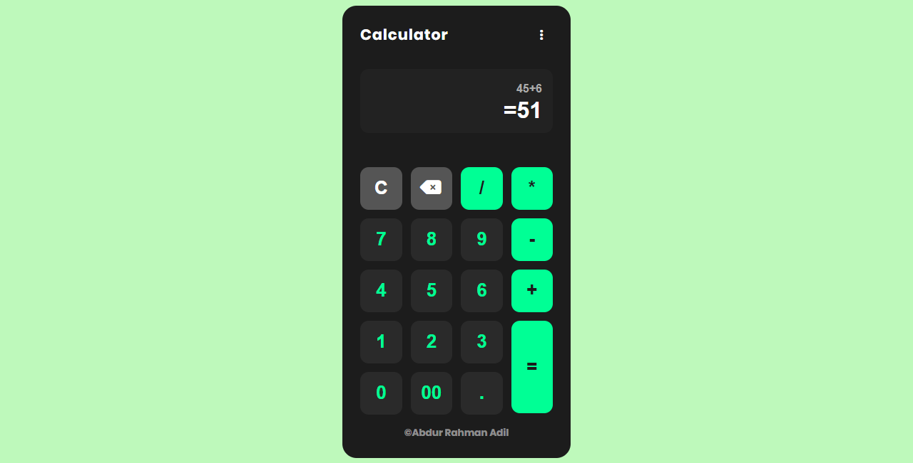
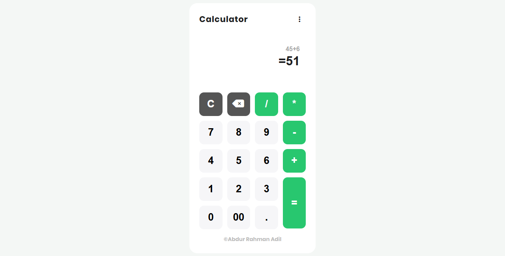

# Calculator App

A modern, feature-rich calculator web application with theme switching, calculation history, and a clean user interface.





## 🎯 Features

- **Basic Operations**: Addition, subtraction, multiplication, and division
- **Decimal Support**: Handle floating-point calculations
- **Double Zero**: Quick input with 00 button
- **Live Calculation**: See results as you type
- **Theme Toggle**: Switch between dark and light modes
- **Calculation History**: Track all your calculations with persistent storage
- **Clear History**: Remove all calculation history with one click
- **Keyboard Support**: Use your keyboard for input (numbers, operators, Enter, Backspace)
- **Delete Function**: Remove last character with backspace button
- **Reset Function**: Clear current calculation
- **Responsive Design**: Works seamlessly on all devices
- **Local Storage**: Remembers your theme preference and calculation history

## 📁 Project Structure

```
calculator/
│
|__ assets              # All assets here
├── index.html          # Main HTML structure
├── css/
│   └── style.css       # Styles and themes
├── js/
│   └── script.js       # Calculator logic and functionality
└── README.md           # Project documentation
```

## 🚀 Getting Started

### Prerequisites

- A modern web browser (Chrome, Firefox, Safari, Edge)
- No dependencies or installations required!

### Installation

1. **Open the calculator**
   - Simply open `index.html` in your web browser
   - Or use a local server:
     ```bash
     # Using Python 3
     python -m http.server 8000
     
     # Using Node.js (http-server)
     npx http-server
     ```

## 💡 How to Use

### Basic Operations

1. Click number buttons or type on your keyboard
2. Use operator buttons (+, -, *, /)
3. Press = or Enter to calculate
4. Press C to clear current calculation
5. Use backspace button or key to delete last character

### Keyboard Shortcuts

- **Numbers (0-9)**: Input numbers
- **Operators (+, -, *, /)**: Mathematical operations
- **Decimal (.)**: Add decimal point
- **Enter**: Calculate result
- **Backspace**: Delete last character

### Theme Switching

1. Click the three-dot menu icon in the top right
2. Click the sun/moon icon to toggle between light and dark themes
3. Your preference is automatically saved

### Calculation History

1. Click the menu icon to open the sidebar
2. View all your previous calculations
3. Click the trash icon to clear all history
4. History is automatically saved in local storage

## 🎨 Theme Customization

The calculator comes with two built-in themes:

### Dark Theme (Default)
- Modern dark background with green accent
- Easy on the eyes for extended use
- Professional appearance

### Light Theme
- Clean white background with green highlights
- Perfect for bright environments
- Minimal and elegant design

### Custom Colors

You can customize colors by editing the CSS variables in `css/style.css`:

```css
:root {
  --bg-body: #bef9bb;
  --bg-container: #1c1c1c;
  --btn-color: #00ff95;
}
```

## 🔧 Technical Details

### Technologies Used

- **HTML5**: Semantic structure
- **CSS3**: Modern styling with CSS variables
- **JavaScript ES6**: Calculator logic and DOM manipulation
- **Local Storage API**: Persistent data storage
- **Font Awesome**: Icons

### Key Features Implementation

- **Live Calculation**: Uses `eval()` for instant result display
- **Theme Persistence**: Saved in localStorage
- **History Management**: JSON-based storage
- **Responsive Grid**: CSS Grid for button layout
- **Event Handling**: Both click and keyboard events

## 📱 Browser Compatibility

- Chrome (Latest)
- Firefox (Latest)
- Safari (Latest)
- Edge (Latest)
- Opera (Latest)

## 🐛 Known Issues

- None at the moment

## 🔮 Future Enhancements

- [ ] Scientific calculator mode
- [ ] Memory functions (M+, M-, MR, MC)
- [ ] Percentage calculations
- [ ] Square root and power functions
- [ ] Expression editing
- [ ] Export history to CSV
- [ ] More theme options
- [ ] Sound effects toggle
- [ ] Copy result to clipboard

## 📄 License

This project is open source and available under the [MIT License](LICENSE).

## 👨‍💻 Author

**Abdur Rahman Adil**

## 📞 Support

If you encounter any issues or have suggestions, feel free to reach out or open an issue.

## ⭐ Show Your Support

Give a ⭐️ if you like this project!

---

**Happy Calculating!** 🧮